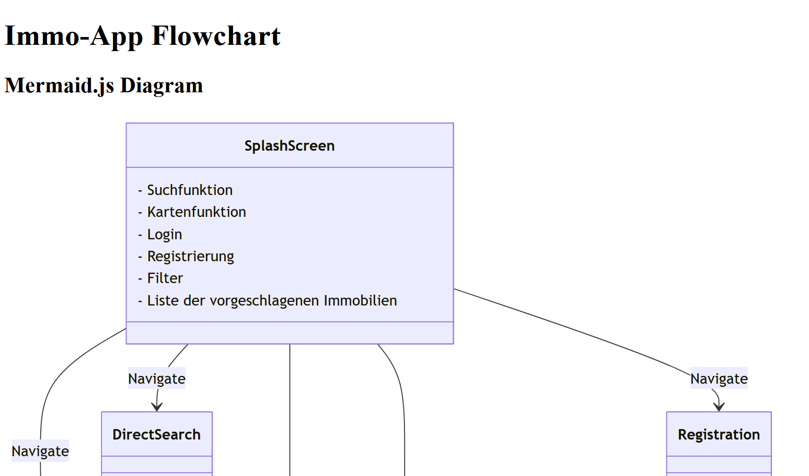
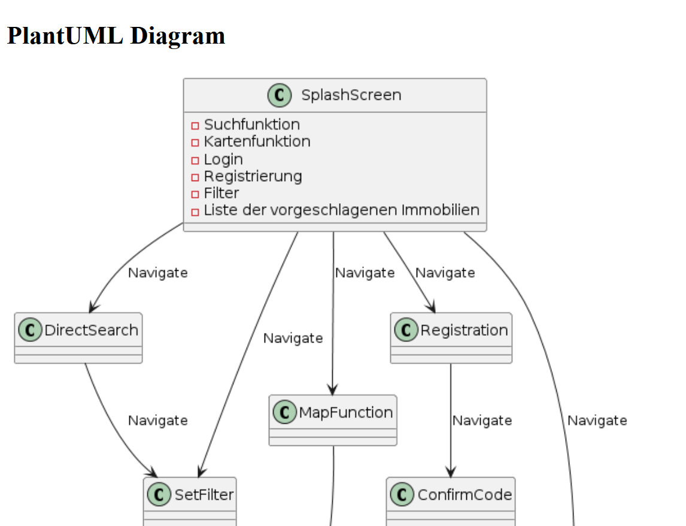

# Immo-App Flowchart

This repository contains a visual representation of the Immo-App workflow using Mermaid.js and PlantUML.

## Diagram Preview

### Mermaid.js Diagram
Mermaid.js is used to create a dynamic diagram representation of the app workflow.

### PlantUML Diagram
PlantUML is used to generate a static diagram of the app workflow.

## Live Preview
You can view the diagrams directly in your browser using this link:

👉 [Immo-App Flowchart](https://rawcdn.githack.com/KLubina/plantuml-example-immo-app/3068bd0dcf1cf9f9bf829e05762c421a727e022c/immo-app.html)

## Structure
- **immo-app.html**: Contains the Mermaid.js diagram and the embedded PlantUML image.
- **Immo-App Flowchart PlantUML.png**: Exported PlantUML diagram.
- **pictures-for-readme/**: Contains images for documentation.

## Technologies
- **Mermaid.js**: For interactive diagrams
- **PlantUML**: For static UML diagrams

